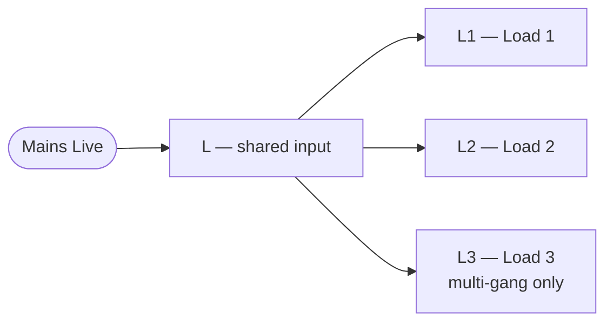
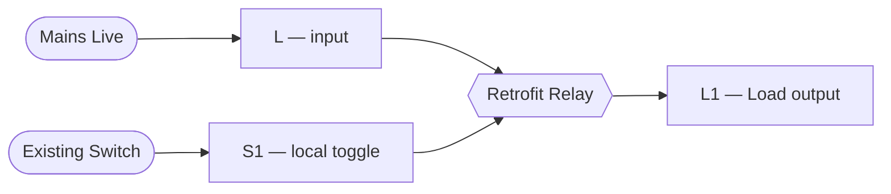
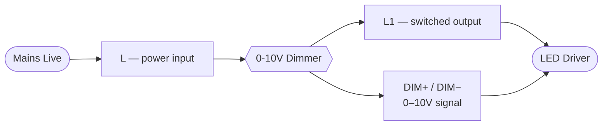
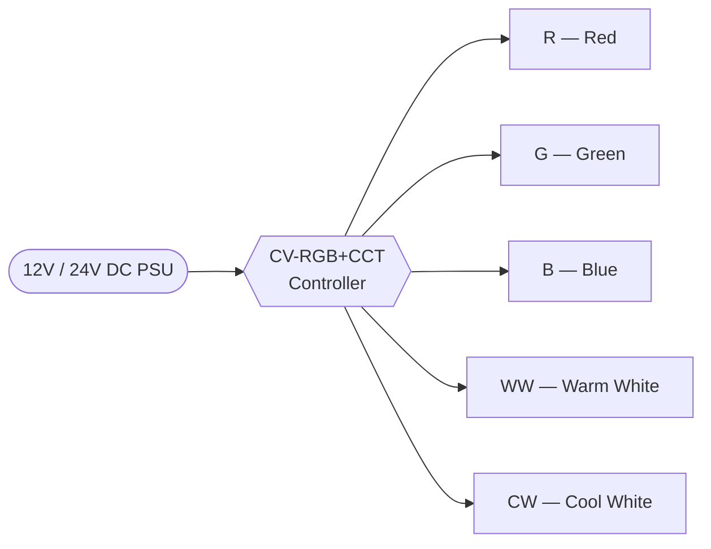
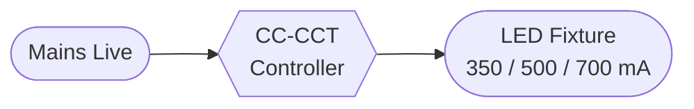
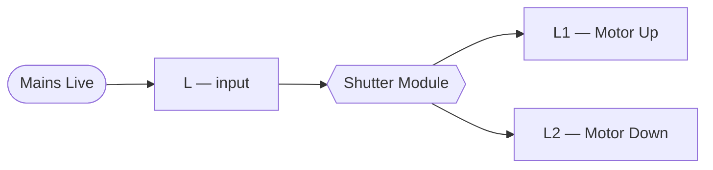
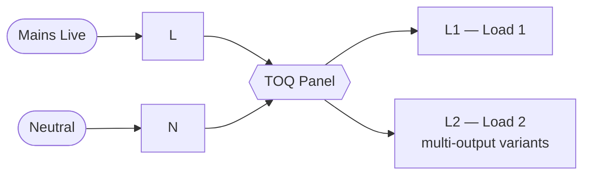

<Callout type="info">
  All TAC smart switches and retrofit relays work **without a neutral wire** — Live and Load only. TOQ panels require neutral.
</Callout>

## Load Ratings

| Device | Rating | Notes |
|---|---|---|
| TAC standard switch (1–6G) | 10A / 2300W per channel | Shared L input, separate output per gang |
| TAC HL heavy-load switch | 16A / 3680W | Pumps, geysers, high-draw loads |
| TAC F fan switch | 1A / 230W | Fan speed control only |
| Retrofit relay 1Ch (standard) | 4A | Behind existing switch, no rewiring |
| Retrofit relay 1Ch (heavy) | 40A | Pumps, geysers, HVAC compressors |
| Retrofit relay 2Ch | 4A per channel | 2 independent circuits, 1 module |
| Retrofit dimmer 1Ch | 200W resistive / 100W LED | Phase-cut — dimmable loads only |
| 0–10V dimmer | — | Commercial LED drivers with 0–10V input |
| Shutter module | 5A / 1150W | AC motors with end-stop protection only |
| TAC SH shutter switch | 5A | Premium wall-switch shutter control |

## TAC Smart Switches

No neutral required. Each gang has its own output terminal; all share a single L input.

## Retrofit Relay

Installs **behind the existing wall switch** — no rewiring, no new backbox. The existing switch toggles locally; Zigbee overrides it remotely.

**Standard (4A)** — lighting, fans, general loads.
**Heavy-duty (40A)** — pumps, geysers, AC compressors, high-inrush motors.

## Retrofit Dimmer

<Callout type="warn">
  Phase-cut dimming only. **Not compatible** with non-dimmable LED drivers, fluorescent fixtures, or motors.
</Callout>

- Minimum load: **5W**
- Maximum load: **200W resistive / 100W dimmable LED**
- Dimmable LED drivers must be explicitly rated for phase-cut dimming

### 0–10V Dimmer

For **commercial LED drivers** with a 0–10V control input (common in offices, retail, hospitality).

## LED Controllers

### CV-RGB+CCT (Constant Voltage)

For 12V or 24V LED strip lights. Controls RGB colour + warm/cool colour temperature simultaneously.

### CC-CCT (Constant Current)

For current-fed LED fixtures and commercial downlights (350 mA / 500 mA / 700 mA).

## Shutter / Blind Module

<Callout type="warn">
  AC motors only. Motor **must have built-in end-stop protection** — do not use with motors lacking end-stops.
</Callout>

The module detects end-stop via current sensing. Configure travel time in the Zigbee coordinator after installation.

## TOQ Touch Panels

TOQ panels **replace** the existing switch backbox. They require a **neutral wire** in addition to Live.

Available in 1-gang, 2-gang, and 3-gang backbox form factors.
